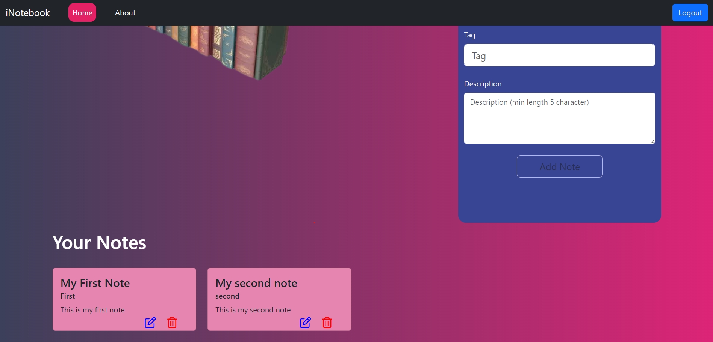

# iNotebook - Your Notes on the Go

## Visit the App
[Click here to visit the iNotebook React App](https://i-notebooklalit.vercel.app/)

## Introduction

**iNotebook - Your Notes on the Go** is a user-friendly web application that features a secure user authentication system. It enables users to effortlessly manage their notes, ensuring that their thoughts and ideas can be captured, edited, and accessed anytime, anywhere. Users have the flexibility to edit their existing notes as well as delete ones they no longer need. This platform provides a seamless experience for efficient note-taking and organization.

## Features

- **User-Friendly Interface**: A clean and intuitive user interface that is easy to navigate, catering to users of all technical levels.

- **Secure User Authentication**: Robust user authentication system for the security and privacy of your data and notes.

- **Note Creation and Editing**: Effortlessly create and edit your notes to capture and refine your thoughts and ideas.

- **Cloud Storage**: Store your notes securely in the cloud, enabling access from any device with an internet connection.

- **Note Organization**: Categorize and organize your notes using tags or categories for quick and convenient retrieval.

- **Efficient Note Management**: Speed and efficiency in managing and accessing your notes, allowing you to concentrate on your work and ideas.

These features are designed to provide you with a seamless note-taking and organization experience.

## Technologies

iNotebook is built using a variety of technologies, including:

- **Frontend**:
  - React (for building the user interface)
  - React Router (for navigation)
  - Bootstrap CSS and JavaScript (for responsive and attractive styling)

- **Backend**:
  - Node.js with Express for API development
  - MongoDB for data storage

- **Authentication**: Secure authentication using JSON Web Tokens (JWT).

## Usage

**iNotebook - Your Notes on the Go** can be used to store your notes and any other text information on the cloud, making them accessible from anywhere over the internet. It provides a convenient way to:

- Capture and securely store your thoughts, ideas, and notes.
- Edit your notes on the go, whether you're at home, at work, or on the move.
- Access your notes from any device with an internet connection.
- Ensure that your information is available when you need it, no matter where you are.

The platform's user-friendly interface and robust cloud storage make it an ideal choice for efficient note-taking and information organization.

## Contributing

Contributions are welcome! If you find any issues or have suggestions for improvement, please feel free to open an issue or create a pull request. To contribute to the project:

1. Fork the repository.
2. Create a new branch for your feature or bug fix: `git checkout -b feature/your-feature-name` or `bugfix/issue-description`.
3. Make your changes and commit them: `git commit -m 'Description of your changes'`.
4. Push to your branch: `git push origin feature/your-feature-name`.
5. Open a pull request to the main branch of this repository.

Please make sure your code follows the project's coding standards and conventions. Ensure that your pull request includes a clear description of the problem you are solving or the feature you are adding.

Your contributions help improve **iNotebook - Your Notes on the Go** for everyone. Thank you for helping make this project better!

## Acknowledgments

Thanks to the developers of React, NewsApi, React Router, and Bootstrap for providing excellent tools and libraries. Your contributions to the open-source community have greatly benefited the development of **iNotebook - Your Notes on the Go**.
